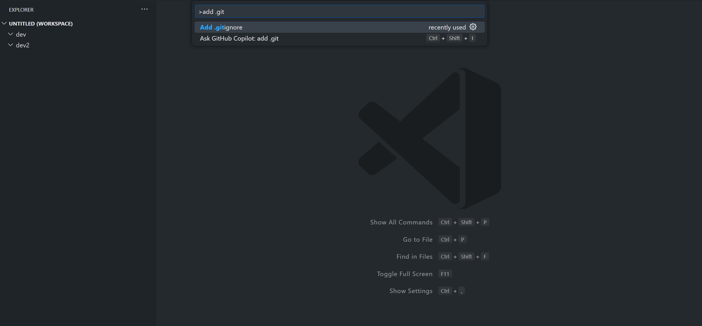
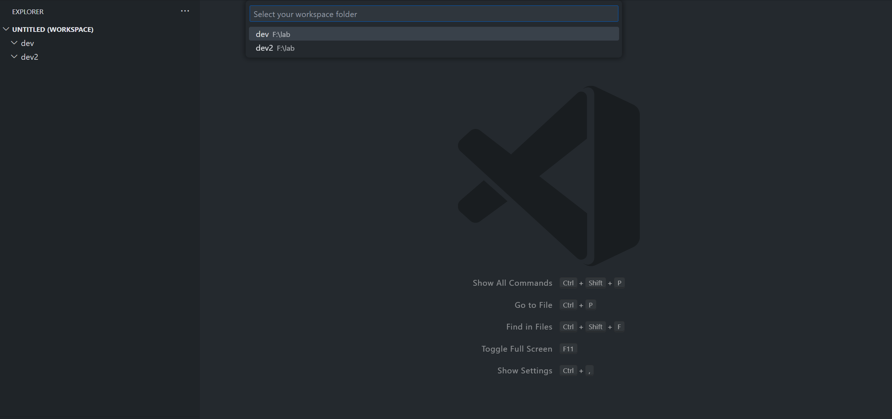
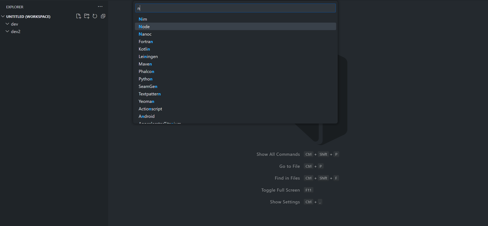
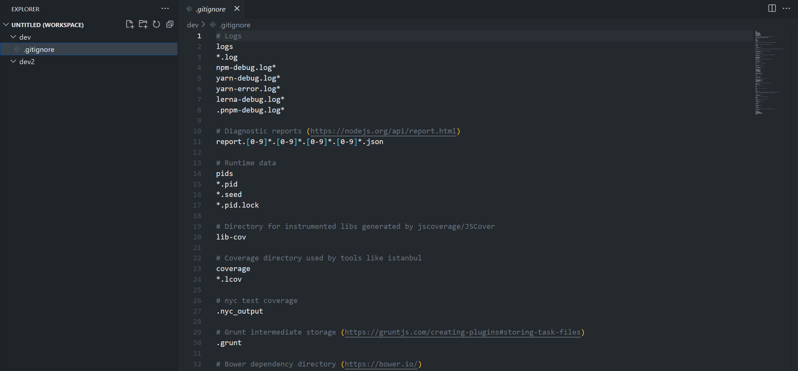
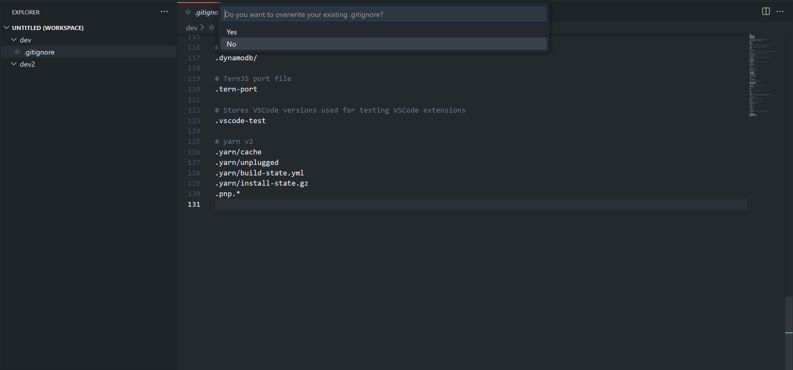
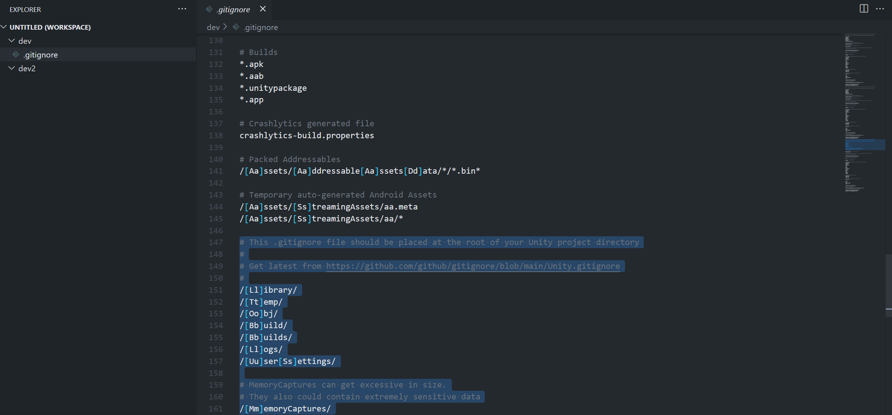

# add-gitignore

`add-gitignore` is a VS Code extension that streamlines the process of adding `.gitignore` files to your projects. It offers an intuitive interface to select and apply `.gitignore` templates directly from the renowned [github/gitignore](https://github.com/github/gitignore) repository.

## Features

### 🚀 Easy Integration
With just a few clicks, you can integrate the desired `.gitignore` template into your project.

### 🌐 Extensive Template Collection
Choose from a comprehensive list of templates sourced from [github/gitignore](https://github.com/github/gitignore).

### 🖼️ Visual Commands
Intuitive command palette options with visual aids:
- **Add .gitignore**: Kick start the process.
  

### 🌌 Multi-Workspace Support
Working with multiple projects? No worries! If multiple workspaces are detected, the extension will prompt you to pick one.

### 🕵️ Searchable Project Types
Easily search and select the type of project for which you need a `.gitignore` file.

### 🌱 Seamless Integration
The selected `.gitignore` will be gracefully added to the root of your chosen or currently active workspace.

### 🔄 Extend Existing Files
If your project already has a `.gitignore`, you can opt to extend it with additional configurations.

... [continue with other features if any]

## Release Notes

### Version 0.0.1

🎉 Initial release of `add-gitignore`!

- **Simple Integration**: Quickly add `.gitignore` to any project.
- **Extensibility**: Extend an existing `.gitignore` effortlessly.
- **Multi-Workspace Awareness**: Smooth operation across multiple workspaces.
- **Override Capability**: Full control to override or replace current `.gitignore` files.

